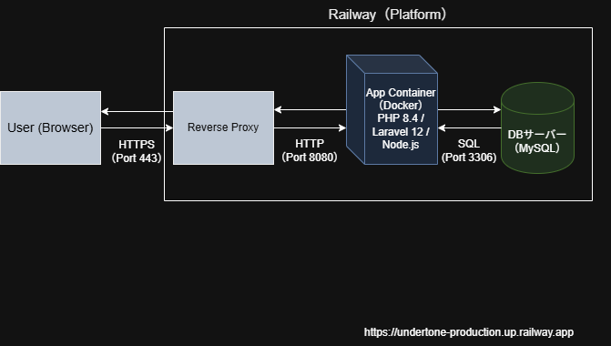

**プロダクト「undertone」概要**

**URL：https://undertone-production.up.railway.app/**

# バンド情報共有プラットフォーム「undertone」
　　音楽ファンが共同で情報を最新に保つことができる、Wiki形式のバンドデータベースです。
  
　　「管理者アカウント：test@example.com / password:testtest」
  
　　「テストユーザー：test1@example.com / password:testtest1」

  ## システム構成図
- Railwayを活用し、GitHubへのプルリクエスト・マージをトリガーとした自動デプロイ（CD)を実現しています。
- Dockerコンテナを利用することで開発環境と本番環境の差異をなくし、安定した動作環境を構築しました。
  

## プロジェクトの概要
　「自分が好きなマイナーバンドの情報を広めたい」「色んなバンドの曲を聴きたい」という
　　ファンの熱量を形にするためのプラットフォームです。
　　情報の正確性を担保するため、独自の「編集提案・承認システム」を導入しています。

## 作成に至った理由

　　最近のインディーズ音楽の注目度から、今までなかったデータベース型のアプリを作成する

　　ことで需要と供給が成り立つのではと考えたからです。

　　ここ最近、インディーズバンドのオーディション関係の動画がSNSで目につくことが多いと感じました。

　　そこに出場したバンド、優勝したバンドなどはもちろん注目を浴びるわけですが、その出場に

　　至らなかったアーティストは山ほどいると思います。

　　そういった、多くの人の目には触れないながらも、ある層には刺さるような音楽が集まる場所を作れば、

　　聴く側も聞かれる側もメリットしかないのでは、と思い考え付いたのがこのアプリでした。

　　バンド側もより多くの人に聞いてもらい、インディーズの色んな音楽を聴きたい人、発掘したい人にも

　　双方にメリットがあると考えます。

　　現在も色んな音楽プラットフォームがありますがインディーズの曲だけを聞こうと思ったら探すのは大変です。

　　その部分の悩みを解決したいと思い作成しました。

## 主要機能
1. **編集提案・承認フロー（最注力機能）**
　　単なるCRUD機能にとどまらず、情報の信頼性を維持するためのワークフローを実装しました。
- 提案機能：投稿者以外のユーザーが、既存データの修正案を送信できます。
- 比較・承認機能：投稿者は「現在のデータ」と「提案データ」を並列で比較し、ワンクリックで承認（データの自動上書き）または却下を選択できます。
- 整合性管理：提案中も元のデータは保持され、承認の瞬間まで公開情報は書き換わりません。

2. **バンド管理機能**
　　YouTube動画の埋め込み表示、詳細な属性情報（活動地域、結成日等）の管理。
    
3. **お気に入り機能**
　　非同期（またはリダイレクト）によるお気に入り登録。

## 開発環境・使用技術

### 開発インフラ
- **OS**: Windows 11 + WSL2 (Ubuntu 24.04 LTS)
  本番環境（Linux）との差異を最小限に抑えるため、WSL2上のLinuxカーネルで動作させています。
 
- **File System**: Linux Native File System (`/home/...`)
　Windows側（/mnt/c/）を経由せず、Linux領域内で完結させることで、高速なファイルI/Oと安定した動作を実現しています。

### Technology Stack
- **バックエンド**: PHP 8.4 / Laravel 12
- **フロントエンド**: JavaScript (Alpine.js), Tailwind CSS
- **データベース**: MySQL 8.4 (Eloquent ORM)
- **インフラ**: Railway, Docker, GitHub Actions (CI/CD)

### Tooling & Editor
- **Editor**: VS Code (Remote - WSL 拡張機能)
- **HTTP Client**: Axios, Postman
- **Build Tool**: Vite (Laravel Vite Plugin)
- **Database Management**: Adminer
- **Version Control**: Git / GitHub

## データベース設計
主に以下のテーブル構成でリレーションを構築しています。
- **users**：ユーザー管理
- **bands**：バンド基本情報
- **edit_requests**：編集提案データ（bandsテーブルと1対多）
- **band_user**：お気に入り管理（中間テーブル）
  データの整合性を保ち、効率的なリレーションを実現するために以下の設計を行いました。

  ### ER図
  

  ### 設計のポイント
- **編集提案フロー**: `edit_requests` テーブルにより、管理者による承認制を実現。
- **お気に入り機能**: `band_user` 中間テーブルを介した「多対多」のリレーションを構築。

## こだわったポイント
- **ユーザー体験（UX）**
  ***ストレスフリーな入力支援***:バリデーションエラー時の入力値保持や、エラー箇所を明示し、ユーザーの再入力コストを最小限に抑えています。
  ***リアルタイム・フィードバック***:いいねボタンの押下時に非同期通信を活用し、ページ遷移なしで状態が更新されるインターフェースを構築。また、「編集提案送信時」や「コンタクトフォーム送信時」のメッセージにより、実行結果を即座に認識できるよう配慮しました。
  ***モバイルフレンドリーな設計***:レスポンシブデザインを徹底し、デバイスを問わず一貫した操作感を提供しています。

- **データ設計**
　***柔軟な所属関係の構築（多対多）***:ユーザーとバンドを中間テーブル（band_user）で紐付けることで、「1人が複数のバンドをお気に入りする」「1つのバンドが複数人にお気に入り登録される」という柔軟なデータ構造を持たせています。

- **セキュリティ**
  ***APIセキュリティ***:認証済みのユーザーのみがAPIを利用できるよう、Laravel の Sanctum や Passport を使用してトークンベースの認証を実装しています。
  
  ***CORS制御***:本番ドメインおよび開発環境（localhost）のみを許可するホワイトリスト形式を採用しています。また、許可対象のパスを api/* 等の必要最小限に限定することで、意図しないクロスサイトリクエストの実行リスクを最小化しています。
  
　***Cookie保護***:HttpOnly, Secure, SameSite(Lax) 属性を適切に付与し、セッションハイジャックやCSRFを防止。
 
  ***CSRF対策***:Laravel標準の XSRF-TOKEN 検証に加え、非同期通信時もトークン照合を徹底。
  
  ***HSTS実装***:自作ミドルウェアにより Strict-Transport-Security ヘッダーを送出。preload 指定を含む厳格なポリシーを適用し、中間者攻撃（SSL剥奪）を防御。

## 今後の実装・拡張予定
- Webサーバー構成の刷新:現在の php -S によるシングルスレッド実行から、Nginx と PHP-FPM の組み合わせに変更
- AWS（Amazon Web Services）への移行による可用性の向上:PaaS（Railway）から、Amazon ECS (Fargate)/RDSを活用した、よりスケーラブルで可用性の高いAWS構成への移行。
- Slackリアルタイムアラート:実装済みのカスタムエラーログ記録（APIのレスポンスが400以上）に加え、Slack Webhookと連携。エラー発生時に即座に通知を受け取り、迅速なトラブルシューティングを可能にします。
- 追加予定機能ほか（バンドメンバー登録、プロフィール画面...）
※メール送信機能は、スパム対策およびセキュリティの観点から、現在は擬似送信（セッションメッセージの表示のみ）に留めています。実運用時にはLaravelのMailableとMailtrap等を用いた実装を予定しています。

## サイト画像（編集提案の流れ）
1. **サイトトップ画面**

2. **バンド詳細画面（バンド登録者以外の表示）**

3. **バンド修正提案画面（バンド登録者以外の表示）**

4. **修正提案送信後の画面（バンド登録者以外の画面）**

5. **修正提案された画面（バンド登録者の画面）**

6. **提案承認後の画面（バンド登録者の画面）**

**参考　プロフィール（faverite）画面**

